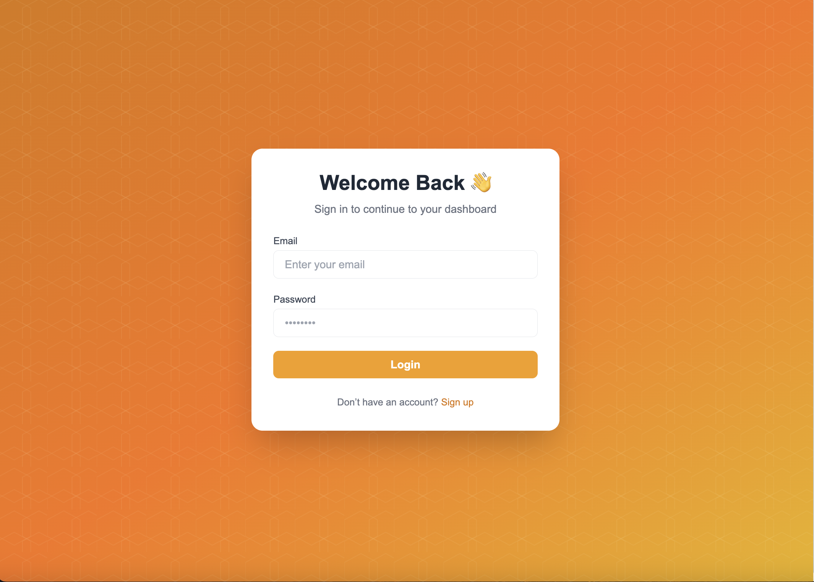
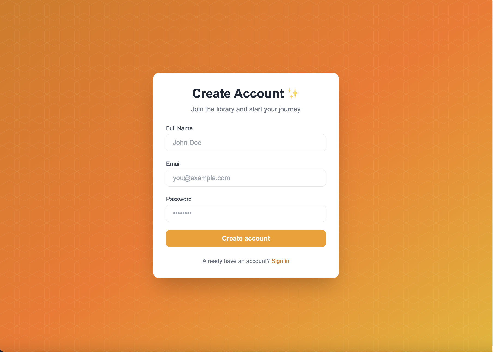
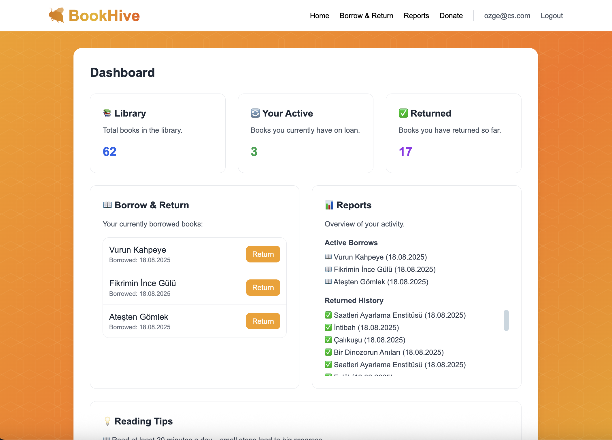
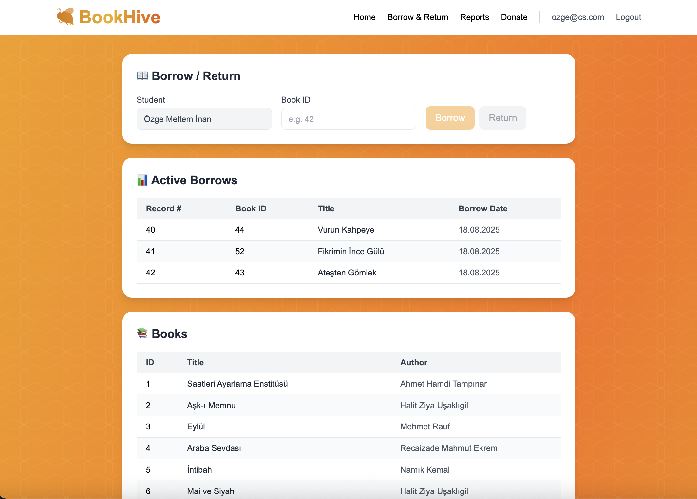
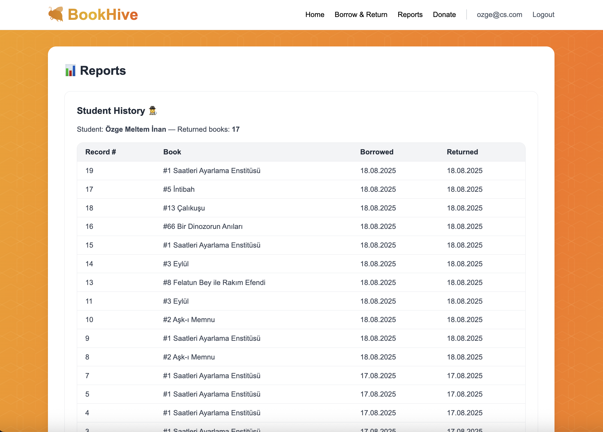
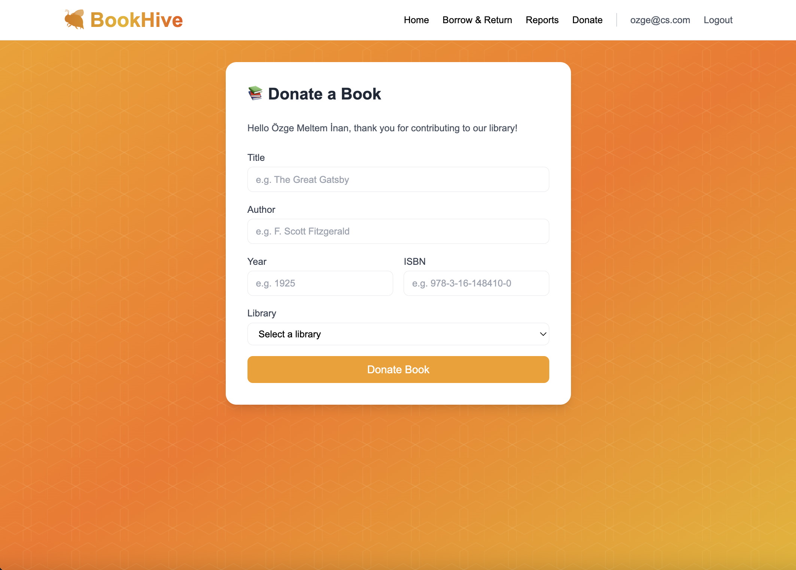

# 🐝 BookHive-Frontend

A modern **React + Vite** frontend for the 🐝 **BookHive** library system.  
This application provides a user-friendly interface for students to register, log in, browse libraries & books, borrow/return books, and view reports.  
>It consumes the RESTful API provided by the **[BookHive Backend](https://github.com/ozgemelteminan/bookhive-backend)**.

<br>

## ⚡ Features

- **Students**: register, login (JWT token stored in browser), view personal borrow history.  
- **Libraries**: browse available libraries.  
- **Books**: browse books by library.  
- **Borrow/Return**: borrow books, return borrowed books.  
- **Reports**: view borrowed books by student or by library.  
- **Dashboard**: personalized student history & active borrowings.  

<br>

## 🚀 Getting Started

### Prerequisites
Make sure you have installed:

- [Node.js](https://nodejs.org/) (>= 18.x recommended)
- npm (comes with Node.js)

### Installation & Running

📥 Clone or download the project:
```bash
git clone https://github.com/ozgemelteminan/library-frontend2
```

📂 Navigate into the project folder:
```bash
cd library-frontend2
```

📦 Install dependencies:
```bash
npm install
```

▶️ Run the project locally:
```bash
npm run dev
```

🌐 Open in your browser:
```
http://localhost:5174
```

⚒️ Build for production:
```bash
npm run build
```

<br>

## 🦾 Tech Stack

- **React 18** (functional components & hooks)  
- **Vite** (fast bundler & dev server)  
- **Tailwind CSS** (utility-first styling)  
- **React Router** (routing, `PrivateRoute` for protected pages)  
- **Axios** (HTTP client, `api.js` abstraction)  
- **JWT Authentication** (stored in `localStorage`)  

<br>

## 📂 Project Structure

```
library-frontend2/
├─ src/
│  ├─ api.js              # Axios instance, baseURL points to backend API
│  ├─ auth.jsx            # Authentication context (login, logout, token storage)
│  ├─ App.jsx             # Main routing component
│  ├─ main.jsx            # React entry point
│  ├─ styles.css          # Tailwind CSS imports + custom styles
│  ├─ components/
│  │   └─ PrivateRoute.jsx   # Protects routes if not logged in
│  └─ pages/
│      ├─ Dashboard.jsx      # Student dashboard (active & past borrowings)
│      ├─ Reports.jsx        # Reports by student/library
│      ├─ Login.jsx          # Student login
│      ├─ Register.jsx       # Student registration
│      ├─ Libraries.jsx      # List libraries & books
│      ├─ Borrow.jsx         # Borrow books
│      └─ Return.jsx         # Return borrowed books
└─ index.html
```

<br>

## 🔗 API Endpoints

> ⚡ The following API endpoints are consumed from the **BookHive Backend** repository.  
> Full backend docs: [bookhive-backend](https://github.com/ozgemelteminan/bookhive-backend)

### Students (`/api/Students`)
| Method | Path                     | Description           |
|--------|--------------------------|-----------------------|
| POST   | `/api/Students/register` | Register new student  |
| POST   | `/api/Students/login`    | Login, receive token  |

### Libraries (`/api/Libraries`)
| Method | Path              | Description           |
|--------|------------------|-----------------------|
| GET    | `/api/Libraries` | List libraries        |
| GET    | `/api/Libraries/{id}` | Get library by id |

### Books (`/api/Books`)
| Method | Path           | Description       |
|--------|---------------|-------------------|
| GET    | `/api/Books`  | List books        |
| POST   | `/api/Books`  | Create book (admin) |

### Borrow/Return (`/api/StudentBooks`)
| Method | Path                                | Description                 |
|--------|------------------------------------|-----------------------------|
| POST   | `/api/StudentBooks`                 | Borrow book                 |
| DELETE | `/api/StudentBooks/{studentId}/{bookId}` | Return book          |
| GET    | `/api/StudentBooks/history/{studentId}` | Borrow/return history |

### Reports (`/api/Reports`)
| Method | Path                          | Description                        |
|--------|-------------------------------|------------------------------------|
| GET    | `/api/Reports/student/{id}`   | Books currently borrowed by student |
| GET    | `/api/Reports/library/{id}`   | Books belonging to a library        |

<br>

## 🔒 Authentication

- JWT token is received from `/api/Students/login`  
- Stored in `localStorage`  
- `PrivateRoute` component protects access to Dashboard, Reports, Borrow, Return, etc.  
- On logout, token is cleared.  

<br>

## 🎨 UI & Styling

- **Tailwind CSS** for styling (see `styles.css`)  
- Simple responsive design with flex/grid  
- Buttons & inputs styled with Tailwind utilities  
- Icons from basic Unicode & Tailwind utilities  

<br>

## 🌐 CORS

The backend (`bookhive-backend`) enables **AllowAll CORS policy**.  
>✅ This means the frontend can call the API from any domain (including `localhost:5174`).  

<br>

### 🔑 Login Page


### 📝 Register Page


### 🏠 Dashboard Page


### 📚 Borrow & Return Page


### 📊 Reports Page


### 🏛 Donate Page


<br>

## 📜 License

This project is for **educational/demo purposes**.  
Frontend consumes API from [BookHive Backend](https://github.com/ozgemelteminan/bookhive-backend).
